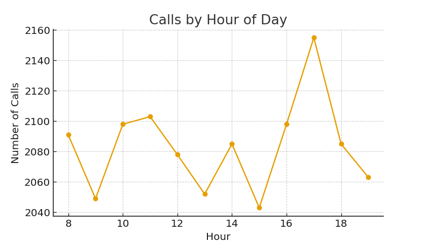

# Telecom Operator Efficiency Analysis 📞📊

**Author:** Luis Chaumer  
**Role:** Data Analyst  
**Tools:** Python, Pandas, NumPy, Matplotlib, SciPy, Jupyter Notebook  
**Dataset:** Simulated dataset — 25,000 calls, 20 operators, 30 days  

---

## 📘 Project Overview

This project analyzes the performance and efficiency of a customer service call center in a fictional telecom company.  
Over a period of **30 days**, the company received **25,000 inbound and outbound calls**, managed by **20 operators**.

The objective of the analysis is to:

- Understand customer wait times and call handling efficiency  
- Detect patterns in call traffic (daily and hourly)  
- Evaluate operator performance using KPI-driven benchmarks  
- Identify inefficient operators based on statistical evidence  
- Deliver actionable recommendations to improve service quality, customer satisfaction, and operational performance  

This project is part of my professional **Data Analyst portfolio**, showcasing end-to-end analytical capabilities.

---

## 📂 Repository Structure

telecom-operator-efficiency/
├── data/
│ └── telecom_calls_dataset.csv
├── notebooks/
│ └── telecom_analysis.ipynb
├── images/
│ ├── wait_time_distribution.png
│ ├── call_duration_distribution.png
│ ├── calls_by_hour.png
│ └── avg_wait_time_by_hour.png
└── README.md

yaml
Copiar código

---

## 📊 Dataset Description

The dataset includes **simulated but realistic** telecom call center activity with the following fields:

- `call_id`: Unique identifier  
- `operator_id`: Assigned operator  
- `client_id`: Customer ID  
- `timestamp_start`, `timestamp_end`: Call timeline  
- `wait_time`: Seconds spent in queue  
- `call_duration`: Duration of conversation  
- `status`: answered / abandoned / missed  
- `call_type`: inbound / outbound  
- `reason`: billing / technical / contract / other  
- `resolution`: resolved / unresolved  
- `customer_satisfaction`: 1–5 rating  

The data was generated programmatically to reproduce realistic call center behavior, including peak hours, satisfaction patterns, and operator performance variation.

---

## 📌 KPIs Used

### **Service-Level KPIs**
- **AWT (Average Wait Time)**
- **AHT (Average Handle Time)**
- **Abandonment Rate**
- **Missed Calls Ratio**
- **FCR (First Call Resolution Rate)**
- **CSAT (Customer Satisfaction Score)**

### **Operator-Level KPIs**
- Call volume per operator  
- Average handling time  
- Resolution rate  
- Productivity indicators  
- Satisfaction score per operator  

These KPIs are commonly used in real telecom and customer service operations.

---

## 📈 Exploratory Data Analysis (EDA)

### **Call Wait Time Distribution**

---

### **Call Duration Distribution**

---

### **Number of Calls by Hour**
This chart highlights peak hours between **10:00–13:00** and **17:00–20:00**.

---

### **Average Wait Time by Hour**
Higher wait times are correlated with peak call traffic.

---

## 🔍 Operator Performance Analysis

The notebook includes a full operator-level evaluation with:

- Ranking of operators by call volume  
- Comparison of resolution rates and CSAT  
- Productivity vs. quality of service  
- Identification of **inefficient operators** using:
  - High wait time  
  - Low resolution rate  
  - Low customer satisfaction  

Inefficient operators are flagged using quantile-based thresholds and validated with statistical testing (t-tests).

---

## 📐 Statistical Testing

A comparison is made between:

- **Efficient Operators**  
- **Inefficient Operators**

Using **t-tests**, we statistically evaluate whether differences in:

- Wait Time  
- Resolution Rate  
- CSAT  

are significant enough to justify performance actions.

---

## 🧩 Key Insights

- Peak hours generate the longest wait times, increasing abandonment.  
- Operator performance varies significantly, with a few operators contributing disproportionately to unresolved cases.  
- Certain call reasons (especially **technical issues**) tend to generate longer durations and lower satisfaction.  
- Inefficient operators show statistically significant differences in wait time, resolution rate, and CSAT.

---

## 🚀 Recommendations

1. **Targeted coaching** for inefficient operators  
2. **Shift optimization** to increase staffing during peak hours  
3. **Service scripts improvement** for technical calls  
4. **Monitor real-time SLA performance** using the KPIs defined  
5. **Develop dashboards** (Tableau, Power BI) for continuous monitoring  

---

## 📒 Notebook

➡️ The full analysis is available in the notebook:  
`notebooks/telecom_analysis.ipynb`

---

## 📬 Contact

If you'd like to discuss this project or my experience:

**Luis Chaumer**  
Data Analyst  
📩 Email: luischaumer@gmail.com
💼 LinkedIn: www.linkedin.com/in/luis-chaumer123
